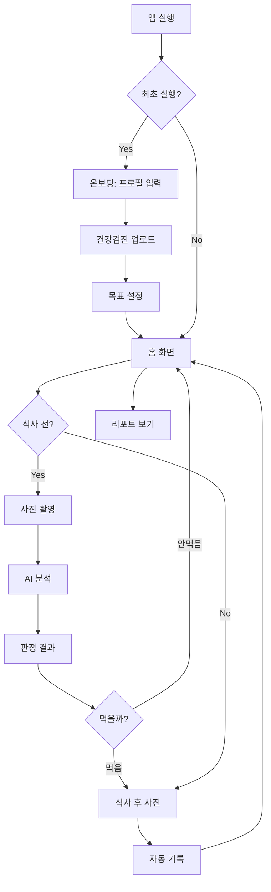

# 먹은대로 (Eat-As-You-Eat) MVP 기획서

**버전:** 1.0
**작성일:** 2025-12-31
**프로젝트 코드명:** Health Meal Coach MVP

---

## 1. 핵심 가치 제안 (Value Proposition)

> **검진표를 넣으면, 매 끼니 식전엔 "먹으면 안 되는지/대체 메뉴"를 경고성으로 알려주고, 식후엔 자동으로 칼로리·영양·기록까지 끝내주는 개인 맞춤 식단 코치**

### 1.1 타겟 사용자

- **1차:** 건강검진에서 이상 소견을 받은 30~50대 (고혈압, 고지혈증, 당뇨 전단계, 비만)
- **2차:** 역류성 식도염, 위염 등 소화기 질환자
- **3차:** 예방 차원의 건강관리 희망자

### 1.2 해결하는 문제

1. **검진 결과는 받았지만 어떤 음식을 피해야 할지 모름**
2. **매 끼니마다 칼로리/영양 계산하기 번거로움**
3. **일반 식단 가이드는 개인 상황 반영 안 됨**
4. **경고성 피드백 부족 → 행동 변화 어려움**

### 1.3 핵심 차별점

| 기존 앱 | 먹은대로 |
|--------|---------|
| 일반 가이드 | **검진 수치 기반 개인화** |
| 식후 기록만 | **식전 경고 + 식후 자동 기록** |
| 긍정 톤 | **경고성 톤 (먹지 말라고 명확히)** |
| 수동 입력 | **사진 1장으로 자동 분석** |
| 칼로리 중심 | **목표별 점수 (혈압/지질/혈당/위장/체중)** |

---

## 2. MVP 기능 명세

### 2.1 온보딩 (Onboarding)

#### 2.1.1 건강 프로필 입력
- **필수 입력:**
  - 성별 (남/여)
  - 연령대 (20대, 30대, 40대, 50대, 60대+)
  - 건강 목표 다중 선택:
    - [ ] 체중 감량
    - [ ] 혈압 관리
    - [ ] 콜레스테롤/중성지방 관리
    - [ ] 혈당 관리
    - [ ] 위장 건강 (역류/위염)

- **선택 입력:**
  - 복용 중인 약물:
    - [ ] 고혈압약
    - [ ] 고지혈증약 (스타틴)
    - [ ] 당뇨약
    - [ ] 위산억제제 (PPI)
    - [ ] 기타 (직접 입력)

  - 알레르기/금기 식품:
    - [ ] 유제품
    - [ ] 견과류
    - [ ] 글루텐
    - [ ] 갑각류
    - [ ] 콩
    - [ ] 기타 (직접 입력)

#### 2.1.2 건강검진 데이터 업로드
- **방법:** 검진표 사진 업로드 (PDF도 지원)
- **추출 항목:**
  - 혈압: 수축기/이완기
  - 혈당: 공복혈당, 당화혈색소 (HbA1c)
  - 지질: 총콜레스테롤, LDL, HDL, 중성지방
  - 간 기능: AST, ALT, γ-GTP
  - 신장 기능: 크레아티닌, eGFR
  - 요산
  - 신체 계측: 키, 체중, 허리둘레, BMI

- **파싱 실패 시:** 수동 입력 옵션 제공
- **개인화 로직:**
  - 각 수치를 정상/경계/이상 3단계로 분류
  - 이상 항목에 대해 식단 제한 강화

---

### 2.2 식사 전 (Pre-Meal) 코칭

#### 2.2.1 입력
- **필수:** 음식 사진 1장
- **선택:** 텍스트 입력 (메뉴명, 재료, 조리법 등)

#### 2.2.2 AI 분석 프로세스
1. 이미지 인식 → 음식 항목 추정
2. 신뢰도 < 0.7 시 최대 2개 질문:
   - "양이 1인분 맞나요?"
   - "소스는 무엇을 사용했나요?"
3. 영양 성분 추정 (칼로리, 탄단지, 당, 나트륨, 포화지방)
4. 사용자 건강 프로필과 매칭 → 판정

#### 2.2.3 출력 (화면 구성)

```
┌─────────────────────────────────────┐
│  🔴 RED - 먹지 마세요               │ (또는 🟡 주의 / 🟢 OK)
│  이 식사는 고혈압에 위험합니다      │
└─────────────────────────────────────┘

📌 먹으면 안 되는 이유
1. 나트륨 1,200mg (검진 혈압 140/90, 하루 권장량의 60%)
2. 포화지방 15g (LDL 콜레스테롤 150mg/dL ↑)
3. 22시 야식 (역류성 식도염 악화 위험)

⚠️ 그래도 먹는다면
- 국물은 1/3만 마시기
- 김치 제외
- 밥 절반으로

✅ 추천 대체 메뉴
1. 삼계탕 (국물 적게, 나트륨 -40%)
2. 구운 닭가슴살 + 샐러드
3. 두부 스테이크 + 현미밥

🎯 오늘의 미션
나트륨 800mg 이하 식사 1회 성공 시 +10점
```

#### 2.2.4 판정 기준 (레드라인)

| 항목 | 기본 임계값 | 검진 이상 시 |
|-----|-----------|------------|
| 나트륨 | >800mg/끼 | >400mg/끼 (-50%) |
| 당 | >20g/끼 | >10g/끼 |
| 포화지방 | >10g/끼 | >5g/끼 |
| 칼로리 | >800kcal/끼 | >600kcal/끼 |
| 역류 트리거 | 야식(21시~), 카페인 >200mg, 탄산/술/산성 | 시간 19시~로 강화 |

---

### 2.3 식사 후 (Post-Meal) 자동 기록

#### 2.3.1 입력
- **필수:** 먹은 후 사진 1장
- **선택:** "절반만 먹음", "국물 안 마심" 등 텍스트

#### 2.3.2 AI 자동 추정
- 음식 항목별 영양 성분 계산
- **가정 명시:** "1인분 기준, 신뢰도 82%"
- 하루 누적 칼로리/영양 자동 업데이트

#### 2.3.3 출력 (간단 피드백)

```
✅ 기록 완료
삼겹살 (150g) + 쌈채소 + 된장찌개

총 칼로리: 720kcal
나트륨: 950mg ⚠️ (목표 초과)
포화지방: 18g 🔴 (LDL 콜레스테롤 주의)

💡 다음 끼니 가이드
- 나트륨 오늘 이미 1,800mg → 저녁은 담백하게
- 채소 부족 → 샐러드나 나물 추천
```

---

### 2.4 게임화 (Gamification)

#### 2.4.1 스트릭 (연속 기록)
- 연속 N일 기록 → 배지 획득
- 3일 / 7일 / 14일 / 30일 마일스톤

#### 2.4.2 미션 시스템
- **일일 미션:**
  - "나트륨 800mg 이하 식사 1회"
  - "식전 사진 업로드 3회"
  - "레드 판정 회피"

- **주간 미션:**
  - "평균 칼로리 1,800kcal 이하"
  - "야식 0회"

#### 2.4.3 목표별 점수 (0~100점)
- **5개 목표 독립 점수:**
  - 체중 점수
  - 혈압 점수
  - 지질 점수
  - 혈당 점수
  - 위장 점수

- **점수 산정 로직:** (docs/Sprint_Backlog.md 참조)

---

### 2.5 리포트

#### 2.5.1 일간 리포트 (Daily Summary)
- 푸시 알림 (21시): "오늘 목표 달성도 75% 🎉"
- 간단 요약:
  - 총 칼로리 / 나트륨 / 당
  - 목표별 점수 변화

#### 2.5.2 주간 리포트 (Weekly Report)
- 매주 일요일 저녁 생성
- 내용:
  1. 목표별 점수 (체중/혈압/지질/혈당/위장)
  2. 가장 큰 악화 요인 TOP3
  3. 가장 잘한 습관 TOP3
  4. 다음 주 미션 3개

---

## 3. 화면 구조 (Screen Flow)

### 3.1 IA (Information Architecture)

```
┌─ 온보딩
│  ├─ 건강 프로필 입력
│  ├─ 건강검진 업로드
│  └─ 목표 설정
│
├─ 홈
│  ├─ 오늘 요약 (칼로리/나트륨/점수)
│  ├─ 식사 전 버튼 (카메라)
│  ├─ 식사 후 버튼 (카메라)
│  └─ 스트릭 표시
│
├─ 식사 전 코칭
│  ├─ 사진 업로드
│  ├─ AI 분석 중
│  └─ 판정 결과 (RED/YELLOW/GREEN + 상세)
│
├─ 식사 후 기록
│  ├─ 사진 업로드
│  ├─ AI 추정 중
│  └─ 기록 완료 + 피드백
│
├─ 기록 (History)
│  ├─ 달력 뷰
│  ├─ 일별 상세
│  └─ 수정/삭제
│
├─ 리포트
│  ├─ 주간 리포트
│  ├─ 월간 리포트 (v2)
│  └─ 목표별 점수 추이 그래프
│
└─ 설정
   ├─ 프로필 수정
   ├─ 건강검진 재업로드
   ├─ 알림 설정
   └─ 데이터 동기화
```

### 3.2 핵심 사용자 플로우



---

## 4. 기술 스택

### 4.1 플랫폼
- **크로스플랫폼:** React Native (iOS + Android)
- **웹 (선택):** React (v2)

### 4.2 백엔드
- **언어:** Python 3.11+
- **프레임워크:** FastAPI
- **데이터베이스:** PostgreSQL 15
- **파일 저장:** AWS S3 (또는 MinIO)
- **캐시:** Redis

### 4.3 AI/ML
- **이미지 인식:**
  - 음식 분류: Fine-tuned Vision Transformer (ViT)
  - 양 추정: YOLOv8 + 3D reconstruction
- **텍스트 추출 (OCR):** Tesseract + GPT-4 Vision (검진표)
- **추론 엔진:**
  - LLM: Claude 3.5 Sonnet (프롬프트 기반)
  - 룰 엔진: 검진 수치 기반 임계값 계산

### 4.4 인프라
- **컨테이너:** Docker + Kubernetes
- **CI/CD:** GitHub Actions
- **모니터링:** Prometheus + Grafana
- **로그:** ELK Stack

---

## 5. 비기능 요구사항 (Non-Functional Requirements)

### 5.1 성능
- 이미지 분석 응답 시간: < 3초 (P95)
- API 응답 시간: < 500ms (P95)
- 동시 사용자: 10,000명 (MVP)

### 5.2 보안
- **데이터 암호화:**
  - 전송: TLS 1.3
  - 저장: AES-256 (건강 데이터)
- **인증:** OAuth 2.0 + JWT
- **개인정보:** GDPR/HIPAA 준수 (익명화 옵션)

### 5.3 가용성
- Uptime: 99.5% (MVP 목표)
- 백업: 일 1회 자동 백업

### 5.4 확장성
- 수평 확장 가능한 아키텍처
- DB 샤딩 준비 (사용자 ID 기반)

---

## 6. 성공 지표 (Success Metrics)

### 6.1 사용자 지표
- **DAU/MAU:** > 40% (높은 습관 형성 목표)
- **스트릭:** 평균 7일 이상
- **식전 업로드율:** > 60%

### 6.2 건강 지표 (사용자 설문)
- **목표 달성도:** 4주 후 "개선됨" 응답 > 70%
- **행동 변화:** "레드 음식 회피" 빈도 증가 > 50%

### 6.3 기술 지표
- **이미지 인식 정확도:** > 85% (Top-3)
- **영양 추정 오차:** ±15% 이내

---

## 7. 출시 일정 (MVP)

### Phase 1: Core Development (4주)
- Week 1-2: 온보딩 + 건강검진 파싱
- Week 3-4: 식사 전/후 AI 분석 + 기록

### Phase 2: Gamification & Polish (2주)
- Week 5: 게임화 + 리포트
- Week 6: UI/UX 개선 + QA

### Phase 3: Beta Testing (2주)
- Week 7-8: 20명 클로즈 베타 → 피드백 반영

### Phase 4: Launch (1주)
- Week 9: 앱스토어 배포 + 마케팅

---

## 8. 리스크 및 제약사항

### 8.1 기술 리스크
- **이미지 인식 정확도:** 한식 특화 데이터셋 필요 → 자체 라벨링 (1,000장)
- **검진표 OCR:** 병원마다 양식 상이 → GPT-4 Vision으로 보완

### 8.2 법률 리스크
- **의료기기 규제:** "진단/치료" 표현 금지 → "가이드" "추천" 용어 사용
- **개인정보:** 건강 데이터는 민감정보 → 암호화 필수

### 8.3 사업 리스크
- **사용자 이탈:** 경고성 톤이 스트레스 → A/B 테스트로 톤 조정
- **습관 형성 실패:** 게임화 요소로 동기부여 강화

---

## 9. 향후 로드맵 (Post-MVP)

### v1.1 (출시 후 3개월)
- [ ] 음성 입력 ("삼겹살 먹었어")
- [ ] 식당 메뉴 DB 연동 (배민/요기요)
- [ ] 가족 공유 기능

### v1.2 (출시 후 6개월)
- [ ] 웨어러블 연동 (혈압계, 혈당계)
- [ ] AI 영양사 채팅
- [ ] 레시피 추천

### v2.0 (출시 후 12개월)
- [ ] 의료기관 연동 (건강검진 자동 불러오기)
- [ ] 보험사 제휴 (건강관리 인센티브)
- [ ] 글로벌 확장 (영어/일본어)

---

## 10. 부록

### 10.1 참고 문서
- [DB 스키마](./DB_Schema.sql)
- [API 명세](./API_Spec.yaml)
- [AI 프롬프트](./Prompts.md)
- [스프린트 백로그](./Sprint_Backlog.md)

### 10.2 용어 정리
- **레드라인:** 절대 피해야 할 영양소 임계값
- **스트릭:** 연속 기록 일수
- **목표별 점수:** 체중/혈압/지질/혈당/위장 5개 독립 점수 (0~100)
- **신뢰도:** AI 추정의 확실성 (0.0~1.0)

---

**문서 끝**
